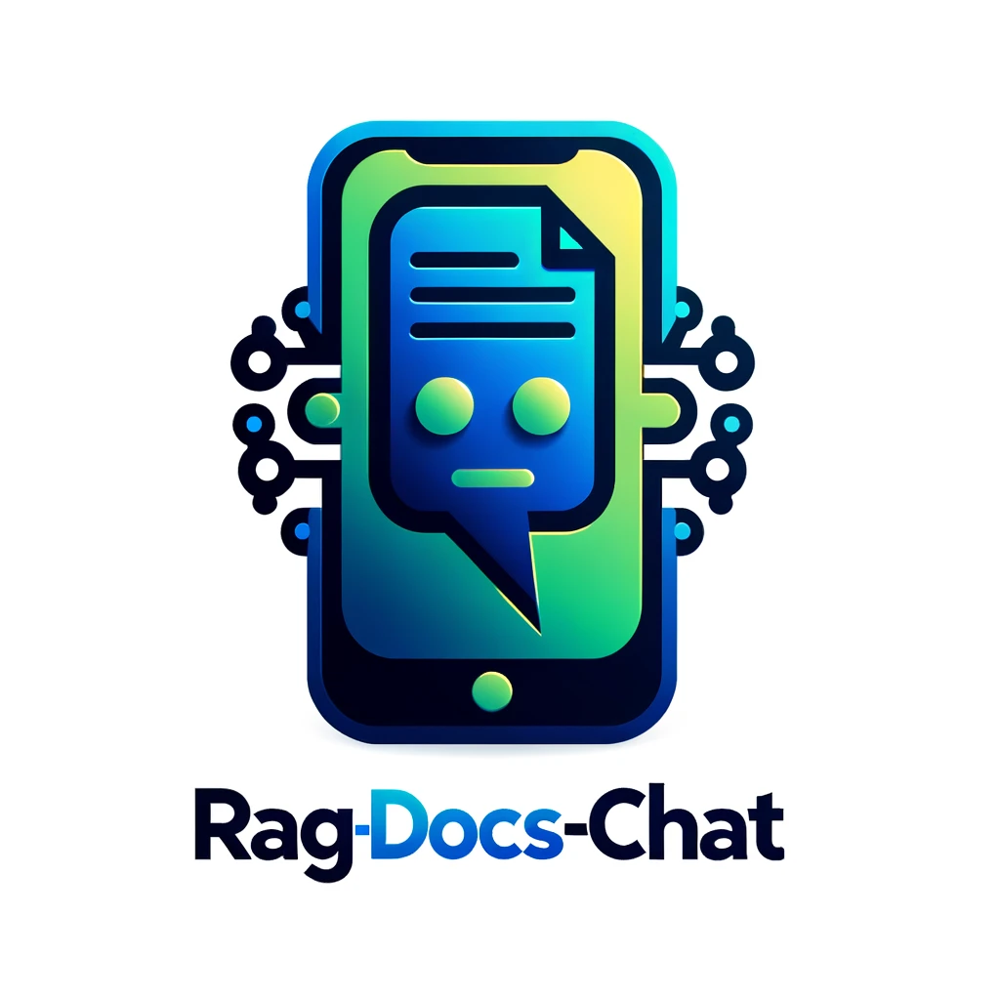

# RAG-Docs-Chat


RAG-Docs-Chat is a modular and extensible framework for building question-answering systems using the LangChain library. This project demonstrates how to set up a retrieval-augmented generation (RAG) model to process and answer queries based on documents loaded from a PDF file.

<div style="text-align: center;">
    
</div>

## Table of Contents

- [Features](#features)
- [Installation](#installation)
- [Usage](#usage)
- [Project Structure](#project-structure)
- [Configuration](#configuration)

## Features

- Load and split documents from a PDF file.
- Embed document chunks using Ollama Embeddings.
- Retrieve relevant document chunks using FAISS.
- Generate responses using a ChatOpenAI model.
- Maintain conversation history with memory buffers.
- Stream responses in real-time.

## Installation

### Prerequisites

- Python 3.8 or higher
- `pip` (Python package installer)
- `virtualenv` (optional but recommended)

### Steps

1. Clone the repository:

    ```bash
    git clone https://github.com/yourusername/RAG-Docs-Chat.git
    cd RAG-Docs-Chat
    ```

2. Create a virtual environment (optional but recommended):

    ```bash
    python -m venv .venv
    source .venv/bin/activate   # On Windows, use `.venv\Scripts\activate`
    ```

3. Install the required packages:

    ```bash
    pip install -r requirements.txt
    ```

4. Install Ollama:

    Download and install Ollama from the official website: [Download Ollama here!](https://ollama.com/download)

5. Set up the environment variables:

    Create a `.env` file in the root directory of the project and add the following variables:

    ```env
    MODEL=llama3
    FILE_PATH=example_file.pdf
    EMBEDDINGS_MODEL=nomic-embed-text
    API_KEY=not-needed
    BASE_URL=http://localhost:11434/v1
    ```

## Usage

To start the RAG-Docs-Chat, run the `main.py` script:

```bash
python main.py
```

You will be prompted to enter a message. The assistant will process the message, retrieve relevant context from the documents, and generate a concise response.

## Project Structure
```env
.
├── config.py
├── example_file.pdf
├── LICENSE
├── main.py
├── models.py
├── README.md
├── requirements.txt
└── utils.py
```

- config.py: Configuration settings for the project.
- example_file.pdf: An example PDF file used for loading documents.
- LICENSE: License information for the project.
- main.py: The main entry point of the application.
- models.py: Model-related functions, including initialization of the ChatOpenAI model and RAG chain.
- README.md: Comprehensive guide and information about the project.
- requirements.txt: List of dependencies required for the project.
- utils.py: Utility functions for loading documents, embeddings, memory, and retriever.

## Configuration
The project uses environment variables for configuration. These variables are defined in the .env file:

- MODEL: The name of the language model to use.
- FILE_PATH: The path to the PDF file containing the documents.
- EMBEDDINGS_MODEL: The embeddings model to use.
- API_KEY: The API key for the language model.
- BASE_URL: The base URL for the language model's API.

